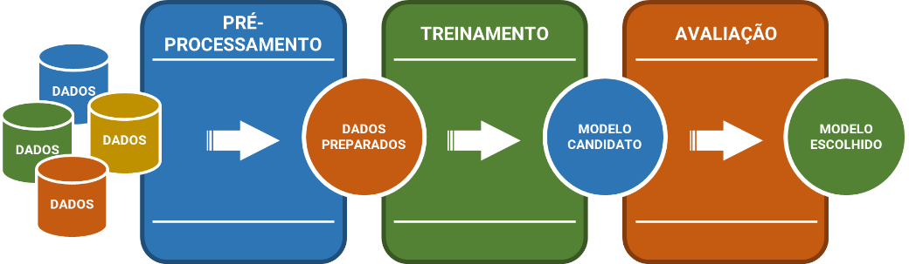
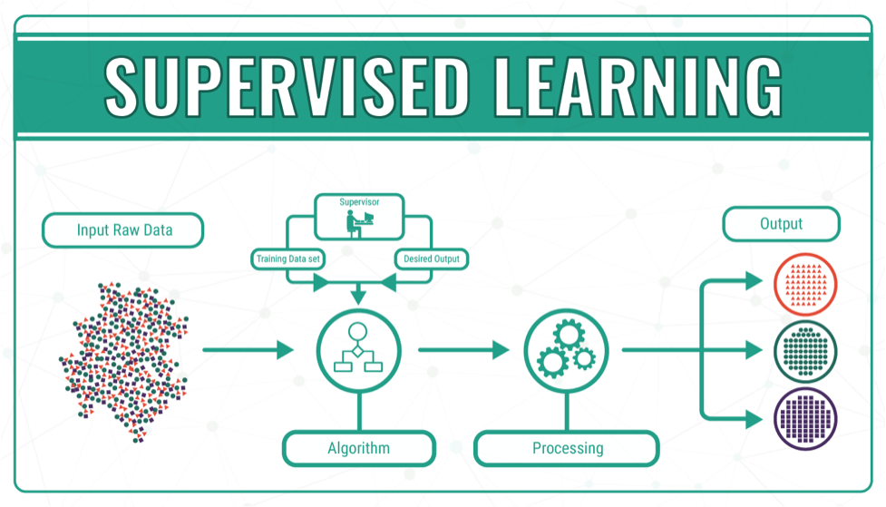
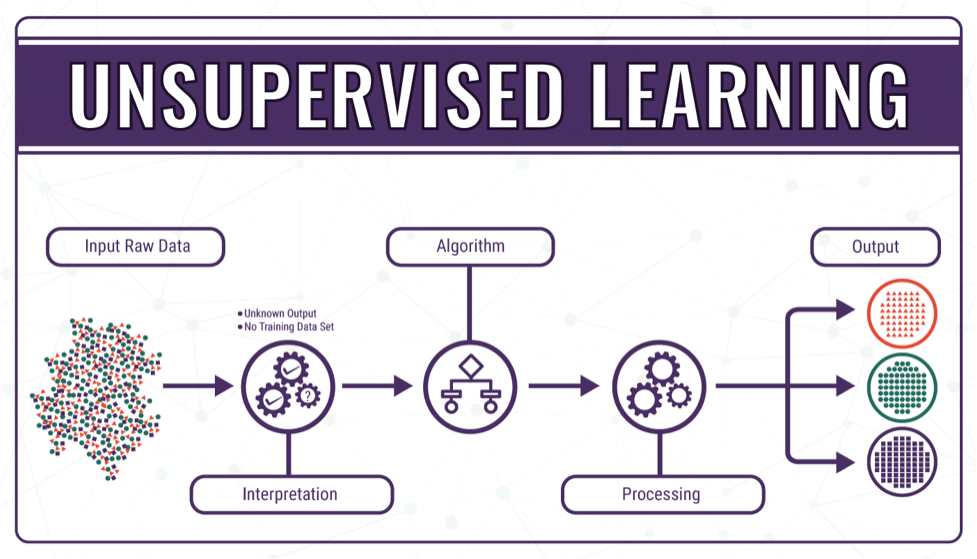
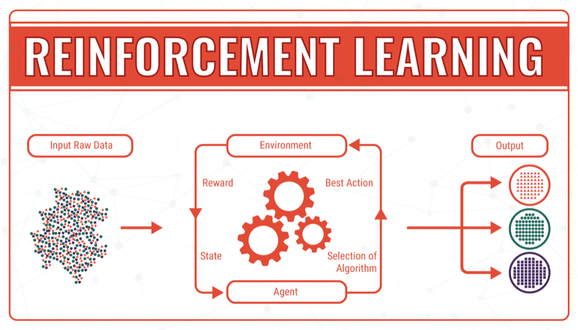
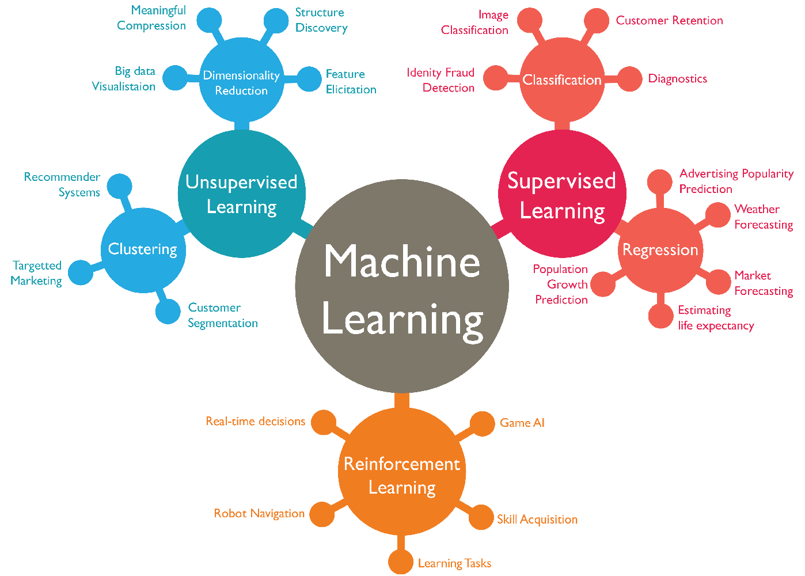

  

 

<ol>
  <li><a href="#sobre">Sobre os Diretórios e Estrutura</a></li>
  <li><a href="#intro">Introdução</a></li>
  <li><a href="#ic-ml-ds">Inteligência Computacional, <em>Machine Learning</em> e <em>Data Science</em></a></li>
  <li><a href="#definicoes">Definições e Terminologia</a></li>
  <li><a href="#tipos-atributos">Tipos de Atributos</a></li>
  <li><a href="#preditivo-descritivo">Métodos Preditivos e Descritivos</a></li>
  <li><a href="#etapas-ml">Etapas de <em>Machine Learning</em></a></li>
  <li><a href="#tipos-ml">Tipos de Aprendizagem de Máquina</a></li>
  <li><a href="#referencias">Referências</a></li>
</ol>

 
<h2 name="sobre">1. Sobre os Diretórios e Estrutura</h2>

Os arquivos aqui presentes são resultados de estudos realizados através do curso <strong>Machine Learning e Data Science com Python</strong>, ministrado pelo Professor Dr. <strong>Jones Granatyr</strong> pela plataforma <strong>Udemy</strong>.

Além disso, pelo carater <strong>acadêmico</strong>, em cada um dos diretórios, com exceção do diretório <strong>arquivos</strong>, será dada uma pequena introdução com algumas informações acerca do assunto abordado e referências para abordagens mais detalhadas.

Abaixo encontram-se os principais diretórios e seus respectivos assuntos.

<h3>1.1. arquivos</h3>

Nesta diretório, encontram-se as <strong><em>bases de dados</em></strong> utilizadas no decorrer dos estudos. Estes arquivos foram adquiridos através do site da <a href="https://archive.ics.uci.edu/ml/index.php">UCI Machine Learning Repository</a>.

<h3>1.2. a_pre-processamento</h3>

Nesta diretório, encontram-se os arquivos relacionados ao estudo acerca do <strong>Pré-Processamento de Dados</strong>, dados estes localizados no diretório <strong>arquivos</strong>. Além disso, neste diretório (<em>a_pre-processamento</em>) encontram-se mais informações sobre o assunto e referências para estudos mais detalhados.

<h3>1.3. b_classification</h3>

Nesta diretório, encontram-se os arquivos relacionados ao estudo de <strong>Classificação de Dados</strong>, dados estes localizados no diretório <strong>arquivos</strong>. Além disso, neste diretório (<em>b_classification</em>) encontram-se mais informações sobre o assunto e referências para estudos mais detalhados.

 
<h2 name="intro">2. Introdução</h2>

De forma geral, <strong>problemas computacionais</strong> são resolvidos por meio da <strong>escrita</strong> de um <strong>programa</strong> que especifica <strong>passo a passo</strong> como o problema deve ser <strong>resolvido</strong>. Podemos definir um <strong>programa</strong> como uma <strong>sequência</strong> de <strong>instruções</strong> que deve ser realizada para <strong>transformar</strong> uma <em>entrada</em> ou um <em>conjunto de entradas</em> em uma <em>saída</em>.

Porém, algumas <strong>tarefas</strong> do dia-a-dia, que são consideradas <strong>simples</strong>, em nível <strong>computacional</strong> torna-se <strong>complexo</strong> o desenvolvimento de <strong>programas</strong>. Podemos citar como exemplo problemas relacionados ao <strong>reconhecimento de pessoas</strong> através <strong>rosto</strong> ou da <strong>fala</strong>. Que <strong>características</strong> dos rostos ou da fala serão <strong>consideradas</strong>? O que fazer para diferentes <strong>expressões faciais</strong> de uma <em>mesma pessoa</em>? E quando há <strong>alterações</strong> como o uso de <em>óculos</em> ou <em>bigode</em>, <em>cortes de cabelo</em>, <em>mudanças na voz</em> por gripe ou estado de espírito?

Nós, seres humanos, fazemos este reconhecimento por meio do <strong>reconhecimento de padrões</strong>, onde <strong>aprendemos</strong> o que devemos observar em um <strong>rosto</strong> ou na <strong>fala</strong> para conseguir <strong>identificar</strong> pessoas, e para isso, necessitamos de vários <strong>exemplos</strong> do <strong>rosto</strong> e/ou <strong>fala</strong> com uma <strong>identificação clara</strong>.

Além do problema relacionado ao reconhecimento de pessoas, podemos levar em consideração que, um bom <strong>médico</strong> consegue, dado o <strong>conjunto de sintomas</strong> e do <strong>resultado</strong> de determinados <strong>exames clínicos</strong>, consegue <strong>diagnosticar</strong> se um paciente está com problemas de saúde. Para tal, o médico utiliza o <strong>conhecimento</strong> adquirido durante sua <strong>formação</strong> e <strong>experiência</strong> proveniente do exercício da <strong>profissão</strong>. Levando estas informações em consideração, como <strong>desenvolver</strong> um <strong>programa</strong> que, dado um <strong>conjunto de sintomas</strong> e os <strong>resultados</strong> dos <strong>exames clínicos</strong>, apresente um <strong>diagnóstico</strong> que seja tão <strong>bom</strong> e <strong>preciso</strong> quanto o de um <strong>médico experiente</strong>?

Como <strong>desenvolver</strong> um <strong>programa</strong> que <strong>analisa</strong> os dados de <strong>venda</strong> de uma loja para <strong>descobrir</strong> quantas pessoas fizeram mais de uma compra no ano anterior? Podemos utilizar os chamados <a href="https://dicasdeprogramacao.com.br/o-que-e-um-sgbd/">Sistemas de Gerenciamento de Bancos de Dados</a>. Mas e para problemas <strong>mais complexos</strong>, como <strong>identificar</strong> um <strong>conjunto de produtos</strong> que são frequentemente <strong>vendidos em conjunto</strong>, ou <strong>recomendar</strong> novos <strong>produtos</strong> a <strong>clientes</strong> que costumam comprar <strong>produtos semelhantes</strong>, ou ainda <strong>agrupar</strong> os <strong>clientes</strong> ou <strong>consumidores</strong> dos produtos de uma determinada loja em <strong>grupos</strong> para <strong>melhorar</strong> os resultados nas operações de <strong><em>marketing</em></strong>?

O número de <strong>tarefas complexas</strong> como essas que precisam ser realizadas <strong>diariamente</strong> é <strong>grande</strong>. Além disso, o <strong>volume de informações</strong> que precisam ser consideradas torna <strong>difícil</strong> ou mesmo <strong>impossível</strong> a sua realização por seres humanos. Como resultado, técnicas relacionadas a <strong>Inteligência Computacional</strong>, em particular de <strong><em>Machine Learning</em></strong> (<strong>Aprendizado de Máquina</strong>), têm sido utilizadas com <strong>sucesso</strong> em um grande número de <strong>problemas reais</strong>, incluindo os citados.

 
<h2 name="ic-ml-ds">3. Inteligência Computacional, <em>Machine Learning</em> e <em>Data Science</em></h2>

A <strong>Inteligência Computacional</strong> ou <strong>Inteligência Artificial</strong> (IA) é um campo pertencente a <em>ciência</em> e da <em>engenharia</em> que surgiu após a <strong>Segunda Guerra Mundial </strong>e é uma <strong>ramificação</strong> da <strong>Ciência da Computação</strong>.

O termo <strong>Inteligência</strong> pode ser definido como a capacidade mental de <em>raciocinar</em>, <em>planejar</em>, <em>resolver problemas</em> e <em>aprender</em>, ao passo de que <strong>Inteligência Computacional</strong> é o ramo da Ciência da Computação que lida com a automação do pensamento e comportamento inteligente.

Um dos primeiros métodos relacionados a verificação de inteligência em um sistema computacional foi o chamado <strong>Teste de Turing</strong>, conhecido como Jogo da Imitação (<em>Imitation Game</em>). Seu objetivo é <strong>avaliar</strong> se um <em>computador</em> ou <em>programa</em> é <strong>inteligente</strong>. De forma resumida, o teste consiste em um indivíduo (<strong>C</strong>) tenta <strong>distinguir</strong> quem enviou a mensagem: se foi um computador (<strong>A</strong>) ou um ser humano (<strong>B</strong>), conforme mostra a imagem abaixo.

 
<h3>Inteligência Computacional</h3>

A Inteligência Computacional, também conhecida como Inteligência Artificial, engloba várias subáreas, como a Robótica, Sistemas Multiagentes, Processamento de Linguagem Natural etc. Ao mesmo tempo que são áreas distintas, as mesmas são correlatas e se baseiam em conhecimentos e conceitos de diversas áreas, como Psicologia, Filosofia, Biologia, Estatística dentre outras.

Muitos pesquisadores optam por utilizar o termo Inteligência Computacional pelo simples fato de que, o termo Inteligência Artificial não possui referências no que diz respeito ao uso do computador. Além disso, algumas revistas científicas utilizam do termo Inteligência Computacional para distinguir determinados tipos ou modalidades de trabalhos e pesquisas científicas na área.

 
<h3>Machine Learning</h3>

Subárea da Inteligência Computacional que proporciona métodos de análise de dados com o intuito de automatizar a construção de modelos analíticos aos sistemas computacionais. Possui a habilidade de aprender e melhorar automaticamente a partir da experiência (E) para esmerar o desempenho (P) ou realizar previsões eficientes e precisas

Machine Learning ou Aprendizado de Máquina pode ser definido como um método computacional que utiliza experiência (E) para aumentar a performance ou desempenho (P), onde podemos definir como experiência (E) informações anteriores disponibilizadas ao algoritmo (learner), que normalmente assume a forma de dados eletrônicos coletados e disponibilizados para análise.

Tais dados podem estar na forma de conjuntos de treinamento com identificação humana (supervisionado) ou outros tipos de informações obtidas por meio da interação com o ambiente (não supervisionado). Além disso, sua qualidade e tamanho são cruciais para as realizações das tarefas.

Em outras palavras, os resultados de um algoritmo de Machine Learning dependem da qualidade e quantidade de dados utilizados. As técnicas de Machine Learning são baseadas em dados que combinam conceitos de ciência da computação com estatística, probabilidade e otimização, das quais, relacionam-se com a análise de dados. Necessita de dados históricos para a criação das relações.

 
<h3>Data Science</h3>

Data Science ou Ciência de Dados é uma área interdisciplinar voltada para o estudo e análise de dados. Sejam dados econômicos, financeiros e sociais, estruturados ou não-estruturados. Visa a extração de conhecimento, detecção de padrões e/ou obtenção de insights para possíveis tomadas de decisão.

 
<h3>Aplicações</h3>

Existem várias aplicações relacionadas a Machine Learning e Data Science, podemos citar, por exemplo:

<ul>
  <li align="justify">Detecção e Reconhecimento Facial: utilizado, por exemplo, em Sistemas de Segurança. Aplicativo do Google Fotos para agrupar fotografias por faces e facilitar o compartilhamento das fotos.</li>
  <li align="justify">Entretenimento: Jogos como o Kinect da Microsoft para a captura e sincronização dos movimentos com o que é apresentado na tela. Óculos de Realidade Aumentada. (News) IA recria fases de Super Mario.</li>
  <li align="justify">Robótica: Robôs humanoides do Google que aprendem a andar e pegar objetos. Carros Autônomos.</li>
  <li align="justify">Saúde: Medicamentos, cura para doenças, detecção de doenças ou predição de doenças. (News) IA detecta Alzheimer 10 anos antes dos primeiros sintomas.</li>
  <li align="justify">Sistemas de Recomendação: Utilizados pela Netflix, Spotfy e sites de encontro como o eHarmony; Sites de compra para a recomendação de produtos (Amazon).</li>
  <li align="justify">Anúncios personalizados: Utiliza dados para exibir anúncios de acordo com as preferências do usuário. Recomendação de Produtos ou Pessoas. Facebook Ads.</li>
  <li align="justify">Sistemas de Busca: Relaciona as palavras buscadas com os assuntos. Utilizado, por exemplo, pela Google.</li>
  <li align="justify">Artes: Criação de Pinturas e Poemas.</li>
  <li align="justify">Detecção de Malware: (News) Google usa Inteligência Artificial para detectar vírus na PlayStore.</li>
</ul>

 
<h2 name="definicoes">4. Definições e Terminologia</h2>

Como já foi visto anteriormente, existem várias áreas relacionadas a Inteligência Computacional. Abaixo, citaremos apenas algumas áreas e termos utilizados.

<ul>
  <li align="justify">Inteligência Artificial (IA) / Artificial Intelligence (AI): Área da Ciência da Computação responsável pelo desenvolvimento de sistemas que simulem a capacidade humana de resolver problemas. Englobam todas as tecnologias e é o termo mais geral.</li>
  <li align="justify">Inteligência Computacional / Computational Intelligence: Candidato para substituir o termo IA, pois este termo (IA) não diz nada referindo a computadores. Geralmente, envolve Redes Neurais, Computação Evolucionária (Algoritmos Genéticos) e Lógica Fuzzy (Nebulosa). Além disso, para trabalhos na IEEE são apenas estes temas que são aceitos como sendo parte da Inteligência Computacional.</li>
  <li align="justify">Sistemas Especialistas / Expert System: Um dos primeiros esforços da IA em criar sistemas que tem como base o conhecimento de um especialista humano, ou seja, seu objetivo é construir sistemas com base no conhecimento de pessoas que são especialistas na área. Para isso, utiliza-se o conhecimento destes especialistas e insere no sistema.</li>
  <li align="justify">Visão Computacional / Computer Vision: Simula o sentido da visão humana, sendo capaz de detectar ou identificar pessoas, animais e/ou objetos. Estes sistemas geralmente são usados na área de segurança e robótica.</li>
  <li align="justify">Aprendizagem de Máquina / Machine Learning: Baseado no aprendizado a partir de uma base de dados.</li>
  <li align="justify">Processamento de Linguagem Natural (PLN) / Natural Language Processing (NLP): Envolve basicamente o computador compreender a semântica da frase, tanto escrita como falada (Text-To-Speak).</li>
  <li align="justify">Algoritmos Genéticos: Conjunto de algoritmos ou técnicas computacionais de otimização meta-heurístico que se baseiam nos princípios evolutivos da Teoria Sintética da Evolução (Neodarwinismo) de Charles Darwin e Gregor Mendel.</li>
  <li align="justify">Sistemas Multiagente: Subárea da Inteligência Artificial Distribuída que estuda agentes autônomos.</li>
  <li align="justify">Mineração de Dados / Data Mining: Extrair informações de uma base de dados, usando técnicas de Machine Learning; Aplicação prática da Machine Learning.</li>
  <li align="justify">Lógica de Fuzzy (Lógica Nebulosa): Usada principalmente com aplicações na área industrial. Seu objetivo é modelar modos de raciocínio aproximados ao invés de precisos.</li>
  <li align="justify">Raciocínio Baseado em Caos: Abordagem que busca resolver novos problemas adaptando soluções utilizadas para resolver problemas anteriores.</li>
  <li align="justify">Redes Neurais Artificiais (RNA): Tipo de Machine Learning que geralmente está relacionado com Deep Learning.</li>
  <li align="justify">Aprendizagem Profunda / Deep Learning: Trabalha exclusivamente com Redes Neurais com várias camadas. Geralmente, utiliza uma grande quantidade de dados, sendo necessário processadores mais potentes.</li>
  <li align="justify">Big Data: Imenso volume de dados utilizados em algoritmos de Machine Learning ou Deep Learning.</li>
  <li align="justify">Ciência de Dados / Data Science: Carreira de Cientista de Dados que está relacionado a Exploração e análise de dados através de Machine Learning. Para tal, utiliza-se de conhecimentos relacionados a Ciência da Computação e a Estatística (Descritiva e Inferencial).</li>
</ul>
  

 
<h2 name="tipos-atributos">5. Tipos de Atributos</h2>

Existem <strong>métodos</strong> ou <strong>algoritmos</strong> que usam determinados <strong>tipos</strong> de <strong>variáveis</strong> ou <strong>atributos</strong>. Alguns algoritmos não trabalham com dados numéricos, como por exemplo, os algoritmos de Regras de Associação. Basicamente, existem 2 (dois) tipos principais de <strong>atributos</strong>:

<table border="0">
<tr>
<td width="70%">
<ul>
<li align="justify"><strong>Numéricos</strong>: são representados por dados do tipo numérico, geralmente do tipo int ou float, porém, nem todo número faz parte desta categoria.</li>
<li align="justify"><strong>Categóricos</strong>: são representados pelos demais tipos dados, geralmente do tipo string e expressam categorias ou tipos.</li>
</ul>
</td>
<td></td>
</tr>
</table>

Os atributos do tipo <strong>NUMÉRICO</strong>, se dividem em outros 2 (dois) tipos:

<table border="0">
<tr>
<td width="70%">
<ul>
<li align="justify"><strong>Contínuo</strong>: representam os dados numéricos reais, ou seja, do tipo float. Podemos citar como exemplo a medição da altura, peso ou temperatura.</li>
<li align="justify"><strong>Discreto</strong>: representam os dados numéricos inteiros, ou seja, do tipo int. Geralmente, estão relacionados a contagem de objetos.</li>
</ul>
</td>
<td></td>
</tr>
</table>

Já os atributos do tipo <strong>CATEGÓRICO</strong>, se dividem em outros 2 (dois) tipos:

<table border="0">
<tr>
<td width="70%">
<ul>
<li align="justify"><strong>Nominal</strong>: representam os dados do tipo string que não expressam uma ordem. Podemos citar como exemplo a cor dos olhos, gênero, ID e nome.</li>
<li align="justify"><strong>Ordinal</strong>: representam os dados do tipo string que são categorizados em uma ordem específica. Podemos citar como exemplo os tamanhos P, M e G, onde, P > M > G, ou seja, expressam uma ordem.</li>
</ul>
</td>
<td></td>
</tr>
</table>

Assim teremos o seguinte esquema relacionado aos tipos de atributos:

 
<h2 name="preditivo-descritivo">6. Métodos Preditivos e Descritivos</h2>

Existem vários algoritmos, técnicas e metodologias que podem ser usados para criar modelos de Machine Learning. Diferem-se nos tipos de dados de treinamento, na ordem, no método pelos quais os dados de treinamento são recebidos e nos dados de teste usados para avaliar o algoritmo.

Os algoritmos categorizados como Preditivos possuem a função de prever uma saída de acordo com os dados de entrada. Geralmente, estes algoritmos estão associados a aprendizagem supervisionada, visto que existe a necessidade de se saber os rótulos de saída durante a fase de treinamento.

Já os algoritmos categorizados como Descritivos possuem a função de descrever, por meio de grupos, um determinado conjunto de dados. Geralmente, estes algoritmos estão associados a aprendizagem não-supervisionado.

<table border="0">
  <tr>
    <th>Aprendizagem Supervisionada</th>
    <th>Aprendizagem Não-Supervisionada</th>
    <th>Aprendizagem por Reforço</th>
  </tr>
  
  <tr>
    <th><em>Métodos Preditivos</em></th>
    <th><em>Métodos Descritivos</em></th>
    <th><em>Causa e Efeito</em></th>
  </tr>
  
  <tr>
    <td>Classificação</td>
    <td>Associação</td>
    <td>Sistema Multiagentes</td>
  </tr>
  
  <tr>
    <td>Regressão</td>
    <td>Agrupamento</td>
    <td>-</td>
  </tr>
  
  <tr>
    <td>-</td>
    <td>Detecção de Desvio</td>
    <td>-</td>
  </tr>
  
  <tr>
    <td>-</td>
    <td>Padrões Sequenciais</td>
    <td>-</td>
  </tr>
  
  <tr>
    <td>-</td>
    <td>Sumarização</td>
    <td>-</td>
  </tr>
</table>

 
<h2 name="etapas-ml">7. Etapas de <em>Machine Learning</em></h2>

Existem muitos <strong>processos</strong> relacionados ao <strong>Gerenciamento de Projetos</strong> destinados à <strong><em>Machine Learning</em></strong>, <strong><em>Data Science</em></strong> e <strong><em>Data Mining</em></strong>. Podemos citar como exemplo, o CRISP-DM (<em>Cross Industry Standard Process for Data Mining</em>), o SEMMA (<em>Sample, Explore, Modify, Model e Assess</em>) e o KDD (<em>Knowledge Discovery in Databases</em>).

Durante o decorrer deste <strong>estudo</strong>, será adotado formato <strong>simplificado</strong> conforme pode-se observar na imagem abaixo.

<ul>
  <li align="justify"><strong>Dados</strong> (<em>Data Science</em>): Arquivos disponibilizados em diferentes formatos para a realização de análises preliminares.</li>
  <li align="justify"><strong>Pré-Processamento</strong> (<em>Data Wrangling</em>): Tratamento dos dados (processos descritos no próximo módulo).</li>
  <li align="justify"><strong>Treinamento</strong>: Submeter os dados tratados aos learner (Algoritmos de <em>Machine Learning</em>).</li>
  <li align="justify"><strong>Avaliação</strong> (<em>Data Analysis</em>): Comparação dos resultados obtidos de cada um dos learner para a seleção do melhor método de acordo com os dados.</li>
</ul>

 
<h2 name="tipos-ml">8. Tipos de Aprendizagem de Máquina</h2>

Existem diversos <strong>métodos</strong> relacionados ao <strong>tipo de aprendizagem</strong> que um algoritmo de <em>Machine Learning</em> pode adotar. Aqui, estes estudos, será visto os métodos <strong>supervisionados</strong>, <strong>não-supervisionados</strong> e <strong>por reforço</strong>.

Vale ressaltar que o objetivo não é se aprofundar, mas sim, utilizar como um guia de referência básica acerca destes assuntos.

 
  
 
<h3>Aprendizagem Supervisionada</h3>

Os métodos ou algoritmos de Aprendizagem Supervisionada (Supervised Learning) são algoritmos que recebem amostras de dados (dados de treinamento ou previsores) e saídas (rótulos, respostas ou classes) previamente conhecidas associadas a cada amostra de dados. Em outras palavras, todas as entradas são rotuladas.

O objetivo principal é aprender a partir do mapeamento ou associação entre amostras de dados de entrada e suas respectivas saídas. A partir do treinamento, o conhecimento adquirido pode ser usado para prever uma outra saída para qualquer nova amostra de entrada desconhecida ou não vista durante o treinamento.

Usados em análises preditivas, onde o objetivo principal é prever alguma resposta para dados de entrada. Os métodos ou algoritmos de Classificação (Classification) e Regressão (Regression) são algoritmos relacionados à Aprendizado Supervisionado (Supervised Learning).

 
<h3>Aprendizagem Não-Supervisionada</h3>

Diferente dos algoritmos de aprendizado supervisionado, nos algoritmos de Aprendizado Não-Supervisionada não há saída conhecida, nem mesmo um supervisor para instruir o algoritmo. Um dos principais objetivos dos algoritmos de aprendizado não-supervisionado é desvendar a organização dos padrões existentes nos dados.

Podemos citar como exemplo, as técnicas de agrupamento (clustering). Com estes agrupamentos, é possível descobrir similaridades e divergências entre os padrões existentes e assim, retirar conclusões acerca dos dados.

<h3>Aprendizagem por Reforço</h3>

Nos algoritmos de aprendizado por reforço, o algoritmo descobre, por meio de tentativa e erro, quais ações geram maiores recompensas.

Geralmente, possuem 3 (três) componentes:

<ul>
  <li align="justify"><strong>Agente</strong>: tomador de decisões.</li>
  <li align="justify"><strong>Ambiente</strong>: tudo com o qual o agente interage.</li>
  <li align="justify"><strong>Ações</strong>: o que o agente pode fazer.</li>
</ul>

Seu objetivo é fazer com que o agente escolha ações que maximizem a recompensa esperada ao longo do tempo. Estes algoritmos são utilizados principalmente pela robótica.

É interessante começar os estudos e os testes nas bases de dados com algoritmos mais simples, pois podem apresentar resultados promissores. Técnicas mais complexas exigem mais processamento (custo elevado). Dependendo da base de dados, não é necessário algoritmos complexos, pois algoritmos simples podem apresentar bons resultados.

Estas são as principais técnicas e algoritmos relacionadas a Machine Learning, no entanto, existem outras, como as Semi-supervised learning, Transductive inference, On-line learning e a Active learning.

 
<h2 name="referencias">9. Referências</h2>
<ul>
  <li align="justify">ALPAYDIN, Ethem. <strong>Introduction to Machine Learning</strong>. 4 ed. Cambridge: MIT, 2020.</li>
  <li align="justify">MOHRI, Mehryar; ROSTAMIZADEH, Afshin; TALWALKAR, Ameet. <strong>Foundations of Machine Learning</strong>. 2 ed. Cambridge: MIT, 2018.</li>
  <li align="justify">RASCHKA, Sebastian; MIRJALILI, Vahid. <strong>Python Machine Learning</strong>: <em>Machine Learning and Deep Learning with Python, scikit-learn, and TensorFlow 2</em>. 3 ed. Mumbai: Packt Publishing, 2019.</li>
</ul>
