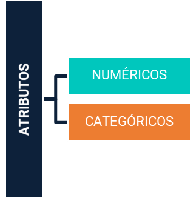
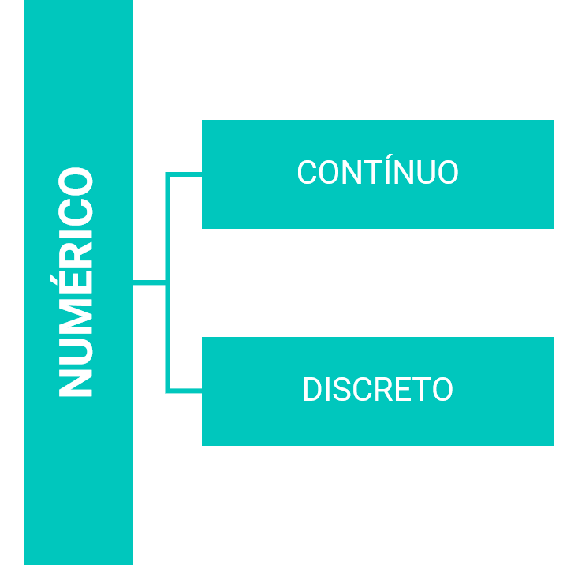
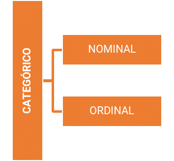
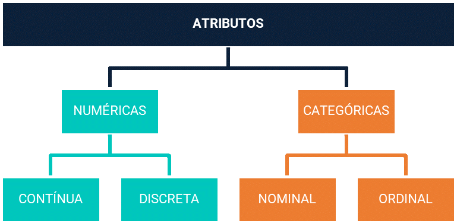

<h1>Machine Learning e Data Science em Python</h1>

 
<ol>
  <li><a href="#sobre">Sobre os Diretórios e Estrutura</a></li>
  <li><a href="#visao-geral">Visão Geral</a></li>
  <li><a href="#ic-ml-ds">Inteligência Computacional, <em>Machine Learning</em> e <em>Data Science</em></a></li>
  <li><a href="#definicoes">Definições e Terminologia</a></li>
  <li><a href="#tipos-atributos">Tipos de Atributos</a></li>
  <li><a href="#preditivo-descritivo">Métodos Preditivos e Descritivos</a></li>
  <li><a href="#etapas-ml">Etapas de <em>Machine Learning</em></a></li>
  <li><a href="#tipos-ml">Tipos de Aprendizagem de Máquina</a></li>
  <li><a href="#referencias">Referências</a></li>
</ol>

 
<h2 name="sobre">1. Sobre os Diretórios e Estrutura</h2>

Os arquivos aqui presentes são resultados de estudos realizados através do curso <strong>Machine Learning e Data Science com Python</strong>, ministrado pelo Professor Dr. <strong>Jones Granatyr</strong> pela plataforma <strong>Udemy</strong>.

Além disso, pelo carater <strong>acadêmico</strong>, em cada um dos diretórios, com exceção do diretório <strong>arquivos</strong>, será dada uma pequena introdução com algumas informações acerca do assunto abordado e referências para abordagens mais detalhadas.

Abaixo encontram-se os principais diretórios e seus respectivos assuntos.

<h3>1.1. arquivos</h3>

Nesta diretório, encontram-se as <strong><em>bases de dados</em></strong> utilizadas no decorrer dos estudos. Estes arquivos foram adquiridos através do site da <a href="https://archive.ics.uci.edu/ml/index.php">UCI Machine Learning Repository</a>.

<h3>1.2. a_pre-processamento</h3>

Nesta diretório, encontram-se os arquivos relacionados ao estudo acerca do <strong>Pré-Processamento de Dados</strong>, dados estes localizados no diretório <strong>arquivos</strong>. Além disso, neste diretório (<em>a_pre-processamento</em>) encontram-se mais informações sobre o assunto e referências para estudos mais detalhados.

<h3>1.3. b_classification</h3>

Nesta diretório, encontram-se os arquivos relacionados ao estudo de <strong>Classificação de Dados</strong>, dados estes localizados no diretório <strong>arquivos</strong>. Além disso, neste diretório (<em>b_classification</em>) encontram-se mais informações sobre o assunto e referências para estudos mais detalhados.

 
<h2 name="visao-geral">2. Visão Geral</h2>

Parágrafo.

 
<h2 name="ic-ml-ds">3. Inteligência Computacional, <em>Machine Learning</em> e <em>Data Science</em></h2>

Parágrafo.

 
<h2 name="definicoes">4. Definições e Terminologia</h2>

Parágrafo.

 
<h2 name="tipos-atributos">5. Tipos de Atributos</h2>

Existem <strong>métodos</strong> ou <strong>algoritmos</strong> que usam determinados <strong>tipos</strong> de <strong>variáveis</strong> ou <strong>atributos</strong>. Alguns algoritmos não trabalham com dados numéricos, como por exemplo, os algoritmos de Regras de Associação. Basicamente, existem 2 (dois) tipos principais de <strong>atributos</strong>:

<table border="0">
	<tr>
		<td width="70%">
			<ul>
	<li align="justify"><strong>Numéricos</strong>: são representados por dados do tipo numérico, geralmente do tipo int ou float, porém, nem todo número faz parte desta categoria.</li>
	<li align="justify"><strong>Categóricos</strong>: são representados pelos demais tipos dados, geralmente do tipo string e expressam categorias ou tipos.</li>
</ul>
		</td>
		<td style="padding: 0 !important"></td>
	</tr>
</table>

Os atributos do tipo <strong>NUMÉRICO</strong>, se dividem em outros 2 (dois) tipos:

<table border="0">
	<tr>
		<td width="70%">
			<ul>
				<li align="justify"><strong>Contínuo</strong>: representam os dados numéricos reais, ou seja, do tipo float. Podemos citar como exemplo a medição da altura, peso ou temperatura.</li>
				<li align="justify"><strong>Discreto</strong>: representam os dados numéricos inteiros, ou seja, do tipo int. Geralmente, estão relacionados a contagem de objetos.</li>
			</ul>
		</td>
		<td></td>
	</tr>
</table>

Já os atributos do tipo <strong>CATEGÓRICO</strong>, se dividem em outros 2 (dois) tipos:

<table border="0">
	<tr>
		<td width="70%">
<ul>
	<li align="justify"><strong>Nominal</strong>: representam os dados do tipo string que não expressam uma ordem. Podemos citar como exemplo a cor dos olhos, gênero, ID e nome.</li>
	<li align="justify"><strong>Ordinal</strong>: representam os dados do tipo string que são categorizados em uma ordem específica. Podemos citar como exemplo os tamanhos P, M e G, onde, P > M > G, ou seja, expressam uma ordem.</li>
</ul>
		</td>
		<td></td>
	</tr>
</table>

Assim teremos o seguinte esquema relacionado aos tipos de atributos:

 
<h2 name="preditivo-descritivo">6. Métodos Preditivos e Descritivos</h2>

Parágrafo.

 
<h2 name="etapas-ml">7. Etapas de <em>Machine Learning</em></h2>

Parágrafo.

 
<h2 name="tipos-ml">8. Tipos de Aprendizagem de Máquina</em></h2>

Parágrafo.

 
<h2 name="referencias">9. Referências</h2>
<ul>
  <li align="justify">ALPAYDIN, Ethem. <strong>Introduction to Machine Learning</strong>. 4 ed. Cambridge: MIT, 2020.</li>
  <li align="justify">MOHRI, Mehryar; ROSTAMIZADEH, Afshin; TALWALKAR, Ameet. <strong>Foundations of Machine Learning</strong>. 2 ed. Cambridge: MIT, 2018.</li>
  <li align="justify">RASCHKA, Sebastian; MIRJALILI, Vahid. <strong>Python Machine Learning</strong>: <em>Machine Learning and Deep Learning with Python, scikit-learn, and TensorFlow 2</em>. 3 ed. Mumbai: Packt Publishing, 2019.</li>
</ul>
